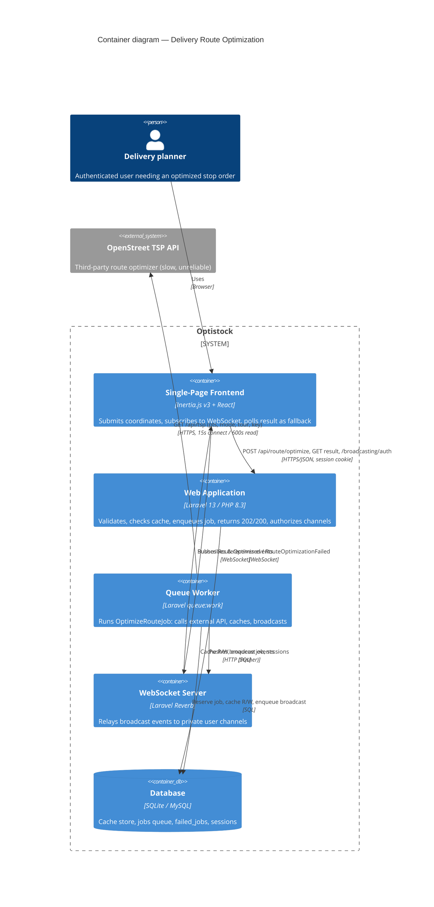
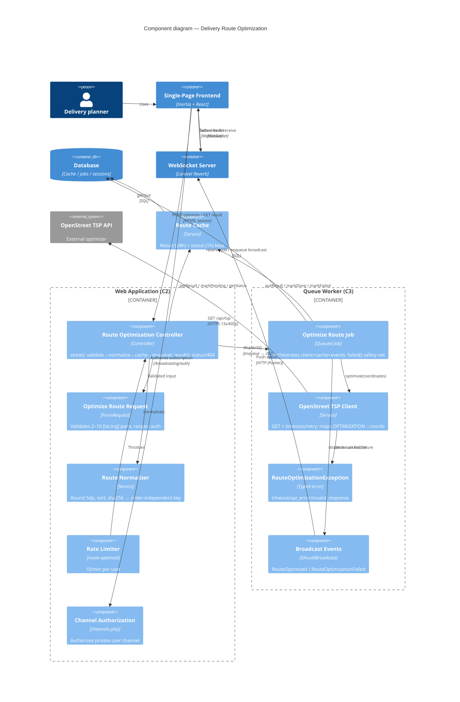

# C4 Architecture — Delivery Route Optimization

Describes the feature at **C4 Level 2 (Containers)** and **Level 3 (Components)**.
Derived from the implemented code (branch `001-delivery-route-optimization`),
verified 2026-06-03. Pairs with `README.md` (ops) and `plan.md` (rationale).

Core behaviour: the user submits coordinates → receives an instant `202` +
`job_uuid` (never blocked on the slow external call) → a background worker calls
the OpenStreet TSP API → the result is cached and pushed back over a WebSocket
(with an HTTP polling fallback). Cache hits short-circuit to an instant `200`.

---

## Level 1 recap (context, for orientation)

- **Person — Delivery planner**: authenticated user who needs an optimized stop order.
- **Software system — Optistock**: the application under design.
- **External system — OpenStreet TSP API**: third-party travelling-salesman solver
  (`https://maps.open-street.com/api/tsp/`). Slow (seconds–minutes for large sets),
  unreliable; called only from background work.

---

## Level 2 — Containers

The feature spans four runtime processes plus one datastore, all inside the
Optistock boundary, talking to one external system.

### Containers

| # | Container | Technology | Responsibility |
|---|-----------|-----------|----------------|
| C1 | **Single-Page Frontend** | Inertia.js v3 + React (browser) | Renders the optimize form/result; POSTs coordinates; subscribes to the private WebSocket channel; polls the result endpoint as fallback. *(Deferred — T016/T020 — but architecturally part of the feature.)* |
| C2 | **Web Application** | Laravel 13 / PHP 8.3 (php-fpm / `artisan serve`) | Handles synchronous HTTP: validates input, checks cache, enqueues work, returns `202`/`200`, serves the polling endpoint, authorizes broadcast channels. Returns in milliseconds — never calls the external API. |
| C3 | **Queue Worker** | Laravel queue worker (`php artisan queue:work --timeout=690`) | Executes `OptimizeRouteJob` off the request cycle: calls the external API, caches the result, records status, dispatches broadcast events. Also runs the queued broadcast jobs. This is the only place the slow call happens. |
| C4 | **WebSocket Server** | Laravel Reverb (`php artisan reverb:start`, port 8080) | Holds the browser's persistent WS connection; receives pushes from the app and relays them to the right private user channel. |
| C5 | **Database** | SQLite (dev) / MySQL-compatible (prod) | Single datastore backing the **cache store**, **queue (`jobs`)**, **`failed_jobs`**, and **sessions** — database driver chosen over Redis for zero extra infra. |

### Container relationships

| From | To | Protocol / detail |
|------|----|-------------------|
| Person | C1 Frontend | Uses (browser) |
| C1 | C2 Web App | `POST /api/route/optimize`, `GET /api/route/result/{job_uuid}` — HTTPS, JSON, **session-cookie auth + CSRF** (same-origin, no API tokens) |
| C1 | C2 Web App | `POST /broadcasting/auth` — authorize private channel subscription |
| C1 | C4 Reverb | WebSocket (wss) — subscribe to `private-App.Models.User.{id}`, receive `RouteOptimized` / `RouteOptimizationFailed` |
| C2 | C5 Database | Read/write cache (result + status), insert queued job, read/write sessions |
| C3 | C5 Database | Reserve/delete job, write cache (result + status), enqueue broadcast job |
| C3 | External OpenStreet TSP API | HTTPS GET — connect timeout 15s, read timeout 600s, 1 retry (backoff) |
| C3 | C4 Reverb | HTTP push (Pusher protocol) when broadcasting an event |
| C4 | C1 Frontend | WebSocket push of broadcast payloads |

### Mermaid (Level 2)

---

## Level 3 — Components

Decomposition of the feature's code. Components live in **one shared codebase**
but execute in two containers: the request path runs in **C2 (Web App)**, the
async path in **C3 (Queue Worker)**. The "Container" column marks where each
runs.

### Components

| # | Component | Code element | Container | Responsibility |
|---|-----------|--------------|-----------|----------------|
| K1 | **Route Optimization Controller** | `App\Http\Controllers\RouteOptimizationController` | C2 | HTTP entry. `store()` orchestrates validate→normalize→cache-check→enqueue, returns `200`/`202`. `result()` returns cached job status or `404`. |
| K2 | **Optimize Route Request** | `App\Http\Requests\OptimizeRouteRequest` | C2 | Authorizes (must be logged in) + validates: 2–10 pairs, each `[lat,lng]`, lat ∈ [-90,90], lng ∈ [-180,180]. |
| K3 | **Route Normalizer** | `App\Services\RouteNormalizer` | C2 | Rounds to 5 decimals, stable-sorts, produces canonical coordinates + `sha256` hash → order-independent cache key. |
| K4 | **Route Cache** | `App\Services\RouteCache` | C2 + C3 | Owns all cache access. Result key `route:opt:{userId}:{hash}` (24h); status key `route:opt:pending:{jobUuid}` (1h, pending/done/failed). |
| K5 | **Optimize Route Job** | `App\Jobs\OptimizeRouteJob` | C3 | Queued orchestrator. `handle()` calls client, caches result+status, dispatches events. `failed()` safety net broadcasts `job_failed`. `$timeout` from config; `$tries=1`. |
| K6 | **OpenStreet TSP Client** | `App\Services\OpenStreetTspClient` | C3 | Builds the GET request, applies split timeout + retry/backoff, maps `OPTIMIZATION[]` indices → caller coordinates + `STEPS_*.TOTAL`, throws typed exceptions. |
| K7 | **Route Optimization Exception** | `App\Exceptions\RouteOptimizationException` | C3 | Typed failure (`timeout` / `api_error` / `invalid_response`) with client-safe `toPayload()`. |
| K8 | **Broadcast Events** | `App\Events\RouteOptimized`, `RouteOptimizationFailed` | C3 → C4 | `ShouldBroadcast` (queued) on `PrivateChannel('App.Models.User.{id}')`. Payloads `{job_uuid,data}` / `{job_uuid,error{code,message}}`. Queued on purpose to keep Reverb off the job's critical path. |
| K9 | **Channel Authorization** | `routes/channels.php` | C2 | Authorizes `App.Models.User.{id}` ⇔ `(int)$user->id === (int)$id`. |
| K10 | **Rate Limiter** | `route-optimize` limiter in `App\Providers\AppServiceProvider` | C2 | 10 requests/min per user (or IP). Applied via `throttle:route-optimize` on the optimize route. |
| K11 | **Service Bindings** | `App\Providers\AppServiceProvider::register()` | C2 + C3 | Binds `OpenStreetTspClient` singleton from `config('services.openstreet')` (url, key, timeout, connect_timeout, retries). |

External to these but adjacent: **Routing** (`routes/api.php` registered in
`bootstrap/app.php` under `/api` with the `web`+`auth` middleware) is the wiring
that exposes K1.

### Component relationships — request path (C2)

| From | To | Detail |
|------|----|--------|
| K1 Controller | K2 Request | Receives validated coordinates (injected `FormRequest`) |
| K1 | K3 Normalizer | `normalize()` → canonical coords + hash |
| K1 | K4 Cache | `getResult(userId, hash)` → hit returns `200 {status:done,data}` |
| K1 | K4 Cache | miss → `markPending(jobUuid)` |
| K1 | K5 Job | `OptimizeRouteJob::dispatch(...)` → enqueue, return `202 {status:pending,job_uuid}` |
| K1 | K4 Cache | `result()` → `getStatus(jobUuid)` → `200` status or `404` |
| K10 Rate Limiter | K1 | Gates the optimize route (429 on exceed) |
| K9 Channel Auth | — | Invoked by `/broadcasting/auth` to permit the SPA's channel subscription |

### Component relationships — async path (C3)

| From | To | Detail |
|------|----|--------|
| K5 Job | K6 Client | `optimize(coordinates)` → external API call |
| K6 Client | OpenStreet API | HTTPS GET; maps response; throws K7 on failure |
| K6 | K7 Exception | `timeout` / `api_error` / `invalid_response` |
| K5 | K4 Cache | success → `putResult(...)` (24h) + `markDone(...)` |
| K5 | K8 Events | success → dispatch `RouteOptimized` |
| K5 | K4 Cache | handled failure (K7) → `markFailed(...)` |
| K5 | K8 Events | handled failure → dispatch `RouteOptimizationFailed` |
| K5 `failed()` | K4 + K8 | uncaught crash → `markFailed('job_failed')` + dispatch failure event |
| K8 Events | C4 Reverb | queued broadcast job pushes payload to Reverb → user channel |

### Mermaid (Level 3)

---

## Key architectural decisions (cross-cutting)

- **Three decoupling boundaries keep the back-end highly available**:
  (1) controller returns `202` + enqueues — frees the frontend; (2) the slow
  external call runs only in the worker — off the HTTP thread; (3) broadcasts are
  queued — a Reverb outage can't cascade into the optimization job.
- **Hard invariant**: `QUEUE_CONNECTION` must be async (`database`), never `sync`,
  or `dispatch()` would run the job inline and block the request for the full
  read-timeout window.
- **Timeout ordering** (see `README.md` §4): `read(600) < job(660) < worker(690) < retry_after(720)`.
- **Order-independent caching**: the normalized sha256 hash means the same stop
  set in any order reuses a cached route.
- **Auth model**: same-origin session cookies + CSRF (no API tokens); WebSocket
  channel access gated by `channels.php`.
