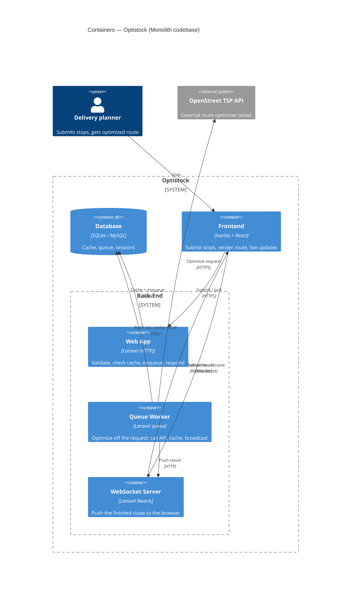
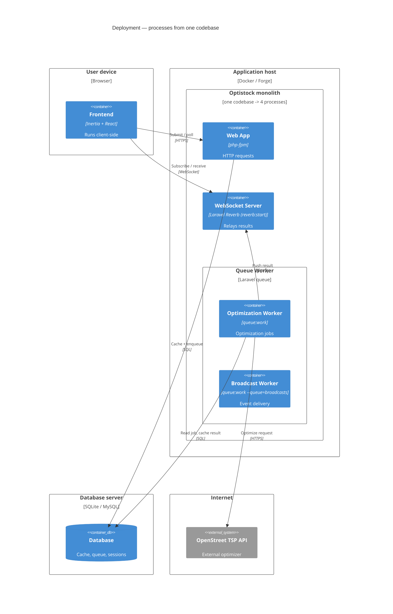
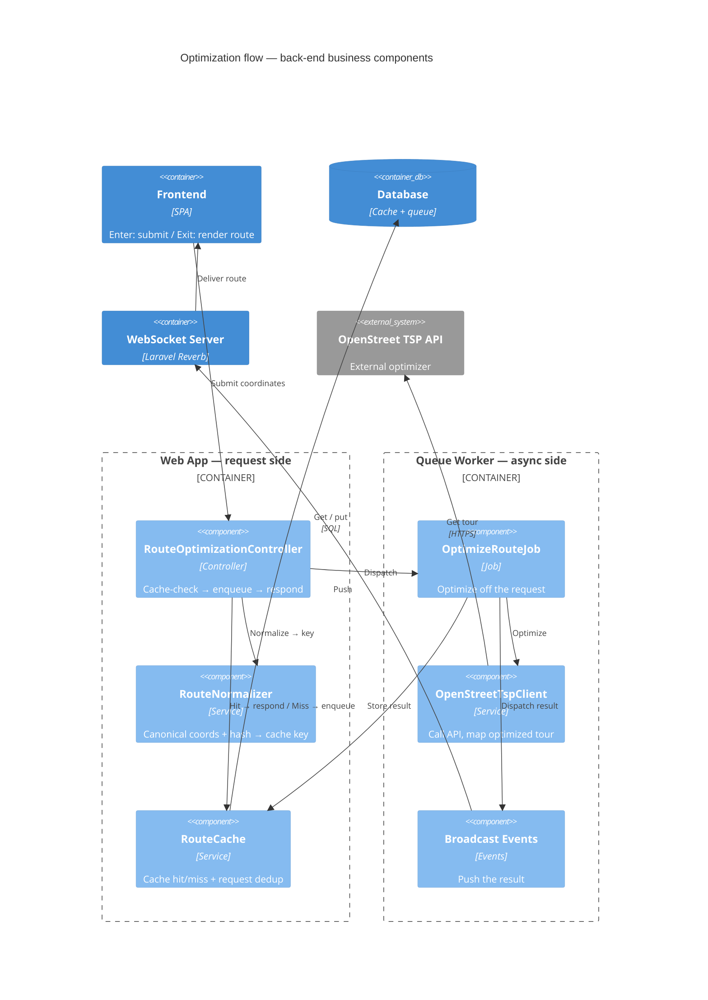
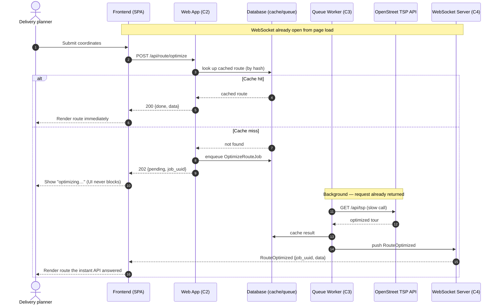

# Architecture — Delivery Route Optimization

# C4 Model

Describes the feature at **C4 Level 2 (Containers)** and **Level 3 (Components)**.
Derived from the implemented code (branch `001-delivery-route-optimization`),
verified 2026-06-05. Pairs with `README.md` (ops) and `plan.md` (rationale).

Core behaviour: the user submits coordinates → receives an instant `202` +
`job_uuid` (never blocked on the slow external call) → a background worker calls
the OpenStreet TSP API → the result is cached and pushed back over a WebSocket
(with an HTTP polling fallback). Cache hits short-circuit to an instant `200`.

---

## Level 1 recap (context, for orientation)

- **Person — Delivery planner**: authenticated user who needs an optimized stop order.
- **Software system — Optistock**: the application under design.
- **External system — OpenStreet TSP API**: third-party travelling-salesman solver
  (`https://maps.open-street.com/api/tsp/`). Slow (seconds–minutes for large sets),
  unreliable; called only from background work.

---

## Level 2 — Containers

Optistock is **one Laravel codebase**. At runtime it spans a frontend, the
back-end app, a queue worker, and a WebSocket server, over one database —
talking to one external optimizer.

| Container | Tech | Role |
|---|---|---|
| **Frontend** | Inertia + React | Submit stops, render route, receive live updates |
| **Web App** | Laravel (HTTP) | Validate, check cache, enqueue work, respond — never calls the slow API |
| **Queue Worker** | Laravel queue | Optimize off the request: call the API, cache, broadcast |
| **WebSocket Server** | Laravel Reverb | Push the finished route to the browser |
| **Database** | SQLite / MySQL | Cache, job queue, sessions |

---

## Deployment

The four back-end roles are **one codebase / one image**, started as four
processes — the worker splits into a dedicated `broadcasts` process so
notifications never wait behind a long optimization job. The boundary box marks
the shared monolith: same build artifact, different start command.

---

## Level 3 — Optimization flow (back-end)

The business classes on the optimized-call path, in one codebase but two
runtime roles: the request side (Web App) and the async side (Queue Worker).
Boilerplate (auth, validation, rate limiting, typed exceptions) is omitted;
external systems and the frontend appear as plain blocks marking where the
flux enters and exits.

| Class | Role |
|---|---|
| **RouteOptimizationController** | Entry: cache-check → enqueue → respond |
| **RouteNormalizer** | Canonical coordinates + hash → order-independent cache key |
| **RouteCache** | Cache hit/miss, and dedup of identical in-flight requests |
| **OptimizeRouteJob** | Runs the optimization off the request cycle |
| **OpenStreetTspClient** | Calls the external API, maps the optimized tour |
| **Broadcast Events** | Push the result back to the browser |

# Sequence Diagram
---

## Runtime sequence — asynchronous optimization flow

The C4 diagrams above are **structural** (who talks to whom). This section is
**temporal**: it shows *when* each call happens and why the user gets an instant
response while the slow external call runs in the background, with the result
delivered over WebSocket the moment the API answers.

Two threads run independently after the `202`:

- **Request thread (C2)** — returns in milliseconds, never touches the external API.
- **Worker thread (C3)** — owns the seconds-to-minutes external call, then pushes
  the result back through the WebSocket Server (Laravel Reverb, C4) over the
  already-open WebSocket.

The full diagram also covers concurrent-request dedup (atomic in-flight
lock), API-failure broadcast, and the WebSocket-miss polling fallback —
see *Key architectural decisions* below. They are omitted here to keep the
core async flow legible.

**Why this gives high responsiveness:**

- The `202` returns on cache miss **before** any external call — perceived latency
  is one fast DB round-trip, not the multi-minute TSP solve.
- The WebSocket is **already open** when the result lands, so push latency ≈ network
  hop; no client polling delay on the happy path.
- Broadcasts ride a **dedicated `broadcasts` queue** — notification delivery never
  waits behind another long optimization job.
- Polling (`GET result`) is a **fallback only**, for a dropped WS connection.

---

## Key architectural decisions (cross-cutting)

- **Three decoupling boundaries keep the back-end highly available**:
  (1) controller returns `202` + enqueues — frees the frontend; (2) the slow
  external call runs only in the worker — off the HTTP thread; (3) broadcasts are
  queued — a Reverb outage can't cascade into the optimization job.
- **Hard invariant**: `QUEUE_CONNECTION` must be async (`database`), never `sync`,
  or `dispatch()` would run the job inline and block the request for the full
  read-timeout window.
- **Timeout ordering** (see `README.md` §4): `read(600) < job(1260) < worker(1290) < retry_after(1320)`.
  Job ceiling covers all upstream attempts: `(retries+1) × read + backoff = 2×600 + 60 = 1260`
  (`services.openstreet.job_timeout`); `DB_QUEUE_RETRY_AFTER=1320` must exceed the worker timeout
  so a still-running job is never re-reserved and run twice.
- **Order-independent caching**: the normalized sha256 hash means the same stop
  set in any order reuses a cached route.
- **Concurrent-request dedup**: an atomic in-flight lock (`claimInflight`, keyed by
  `{userId}:{hash}`) ensures two simultaneous identical requests share one upstream
  call — the loser reuses the winner's `job_uuid`. The job clears the lock on every
  exit (success / handled failure / crash); the lock's TTL (1380s) self-heals a dead
  worker that never clears it.
- **Auth model**: same-origin session cookies + CSRF (no API tokens); WebSocket
  channel access gated by `channels.php`.
